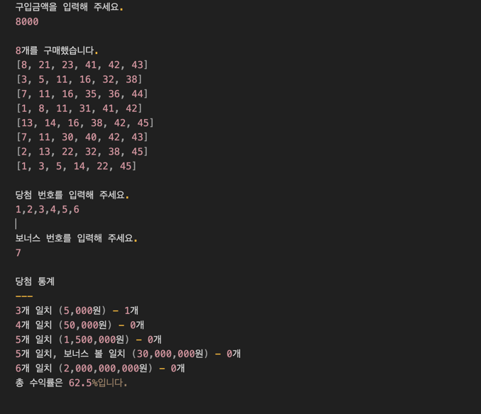

# 프리코스 3주차 미션 - 로또

> 우아한테크코스 7기 3주차 미션, 로또를 구현한 저장소입니다.

<br>



# 목차
- [시작하기](#시작하기)
  - [기능 요구 사항](#기능-요구-사항)
  - [프로그래밍 요구 사항](#프로그래밍-요구-사항)
    - [프로그래밍 요구 사항 1](#프로그래밍-요구-사항 1)
    - [프로그래밍 요구 사항 2](#프로그래밍-요구-사항 2)
    - [프로그래밍 요구 사항 3](#프로그래밍-요구-사항 3)
  - [구현해아 할 기능 목록](구현헤야-할-기능-목록)


### 시작하기

레포지토리를 clone 하고 IDE에서 애플리케이션을 실행합니다.

```git
git clone https://github.com/kimdevspace/java-lotto-7.git
```

### **기능 요구 사항**

간단한 로또 발매기를 구현한다.

- 로또 번호의 숫자 범위는 1~45까지이다.
- 1개의 로또를 발행할 때 중복되지 않는 6개의 숫자를 뽑는다.
- 당첨 번호 추첨 시 중복되지 않는 숫자 6개와 보너스 번호 1개를 뽑는다.
- 당첨은 1등부터 5등까지 있다. 당첨 기준과 금액은 아래와 같다.
    - 1등: 6개 번호 일치 / 2,000,000,000원
    - 2등: 5개 번호 + 보너스 번호 일치 / 30,000,000원
    - 3등: 5개 번호 일치 / 1,500,000원
    - 4등: 4개 번호 일치 / 50,000원
    - 5등: 3개 번호 일치 / 5,000원
- 로또 구입 금액을 입력하면 구입 금액에 해당하는 만큼 로또를 발행해야 한다.
- 로또 1장의 가격은 1,000원이다.
- 당첨 번호와 보너스 번호를 입력받는다.
- 사용자가 구매한 로또 번호와 당첨 번호를 비교하여 당첨 내역 및 수익률을 출력하고 로또 게임을 종료한다.
- 사용자가 잘못된 값을 입력할 경우 `IllegalArgumentException`을 발생시키고, "[ERROR]"로 시작하는 에러 메시지를 출력 후 그 부분부터 입력을 다시 받는다.
    - `Exception`이 아닌 `IllegalArgumentException`, `IllegalStateException` 등과 같은 명확한 유형을 처리한다.


### 프로그래밍 요구 사항

#### **프로그래밍 요구 사항 1**

- JDK 21 버전에서 실행 가능해야 한다.
- 프로그램 실행의 시작점은 `Application`의 `main()`이다.
- `build.gradle` 파일은 변경할 수 없으며, **제공된 라이브러리 이외의 외부 라이브러리는 사용하지 않는다.**
- 프로그램 종료 시 `System.exit()`를 호출하지 않는다.
- 프로그래밍 요구 사항에서 달리 명시하지 않는 한 파일, 패키지 등의 이름을 바꾸거나 이동하지 않는다.
- 자바 코드 컨벤션을 지키면서 프로그래밍한다.
    - 기본적으로 [Java Style Guide](https://github.com/woowacourse/woowacourse-docs/blob/main/styleguide/java)를 원칙으로 한다.

#### **프로그래밍 요구 사항 2**

- indent(인덴트, 들여쓰기) depth를 3이 넘지 않도록 구현한다. 2까지만 허용한다.
    - 예를 들어 while문 안에 if문이 있으면 들여쓰기는 2이다.
    - 힌트: indent(인덴트, 들여쓰기) depth를 줄이는 좋은 방법은 함수(또는 메서드)를 분리하면 된다.
- 3항 연산자를 쓰지 않는다.
- 함수(또는 메서드)가 한 가지 일만 하도록 최대한 작게 만들어라.
- JUnit 5와 AssertJ를 이용하여 정리한 기능 목록이 정상적으로 작동하는지 테스트 코드로 확인한다.
    - 테스트 도구 사용법이 익숙하지 않다면 아래 문서를 참고하여 학습한 후 테스트를 구현한다.
        - [JUnit 5 User Guide](https://junit.org/junit5/docs/current/user-guide)
        - [AssertJ User Guide](https://assertj.github.io/doc)
        - [AssertJ Exception Assertions](https://www.baeldung.com/assertj-exception-assertion)
        - [Guide to JUnit 5 Parameterized Tests](https://www.baeldung.com/parameterized-tests-junit-5)

#### **프로그래밍 요구 사항 3**

- 함수(또는 메서드)의 길이가 15라인을 넘어가지 않도록 구현한다.
    - 함수(또는 메서드)가 한 가지 일만 잘 하도록 구현한다.
- else 예약어를 쓰지 않는다.
    - else를 쓰지 말라고 하니 switch/case로 구현하는 경우가 있는데 switch/case도 허용하지 않는다.
    - 힌트: if 조건절에서 값을 return하는 방식으로 구현하면 else를 사용하지 않아도 된다.
- Java Enum을 적용하여 프로그램을 구현한다.
- 구현한 기능에 대한 단위 테스트를 작성한다. 단, UI(System.out, System.in, Scanner) 로직은 제외한다.
    - 단위 테스트 작성이 익숙하지 않다면 `LottoTest`를 참고하여 학습한 후 테스트를 작성한다.

### **라이브러리**

- `camp.nextstep.edu.missionutils`에서 제공하는 `Randoms` 및 `Console` API를 사용하여 구현해야 한다.
    - Random 값 추출은 `camp.nextstep.edu.missionutils.Randoms`의 `pickUniqueNumbersInRange()`를 활용한다.
    - 사용자가 입력하는 값은 `camp.nextstep.edu.missionutils.Console`의 `readLine()`을 활용한다.

### **사용 예시**

- 1에서 45 사이의 중복되지 않은 정수 6개 반환

```java
Randoms.pickUniqueNumbersInRange(1, 45, 6);

```

### **Lotto 클래스**

- 제공된 `Lotto` 클래스를 사용하여 구현해야 한다.
- `Lotto`에 `numbers` 이외의 필드(인스턴스 변수)를 추가할 수 없다.
- `numbers`의 접근 제어자인 `private`은 변경할 수 없다.
- `Lotto`의 패키지를 변경할 수 있다.

```java
public class Lotto {
	private final List<Integer> numbers;
	
	public Lotto(List<Integer> numbers) {
	    validate(numbers);
	    this.numbers = numbers;
	}
	
	private void validate(List<Integer> numbers) {
	    if (numbers.size() != 6) {
	        throw new IllegalArgumentException("[ERROR] 로또 번호는 6개여야 합니다.");
	    }
	}

// TODO: 추가 기능 구현
}
```

### **구현해야 할 기능 목록**

- 입력 값 유효성 검사
    - 구입 금액이 1,000원 단위인지 확인한다. 아닐 경우 예외처리를 한다. 잘못된 값을 입력헸을 경우 `IlleagalArgumentException`을 발생시키고 [ERROR]로 시작하는 에러 메시지를 출력 후 다시 입력 받는다.
    - 당첨 번호를 입력받는다. 쉼표(,)를 기준으로 숫자를 구분하며, 중복값이 발생 할 경우와 1미만, 45초과 숫자 입력 역시 [ERROR] 메시지를 출력하고 다시 입력 받는다.
    - 보너스 번호의 범위가 1에서 45 사이인지 확인한다. 아닐 시 에러 메시지 출력 후 다시 입력한다.
- 로또 발행
    - 구입 금액에 따라서 발헹헤애하는 로또 개수를 계산한다.
    - Randoms.pickUniqueNumbersInRange(1, 45, 6)을 이용하여 뽑고 로또의 개수와 로또 번호를 오름차순으로 정렬하여 보여준다.
- 당첨 내역 출력
    - 각 등수에 해당하는 당첨 횟수를 출력한다.
- 수익률 계산 및 출력
    - 총 당첨 금액과 로또 구입 금액으로 수익률을 계산하여 소수점 둘째 자리에서 반올림하고 출력한다.
- 테스트 코드 작성
    - 단위 테스트 작성하기